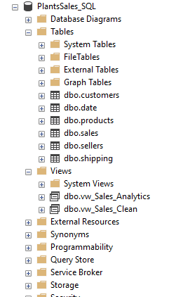
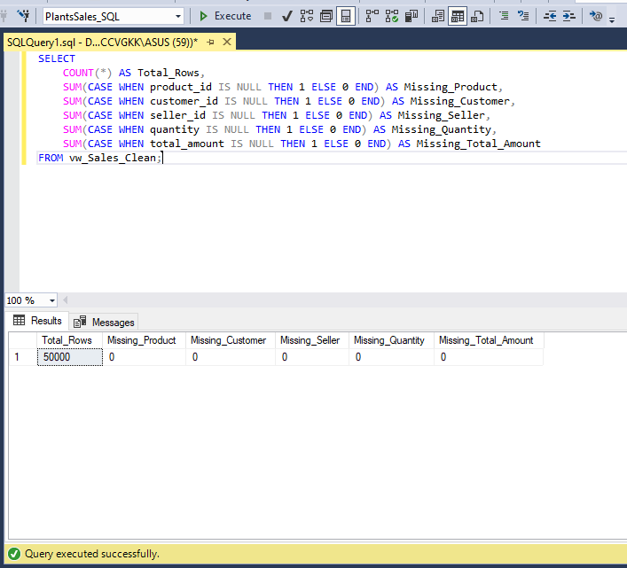
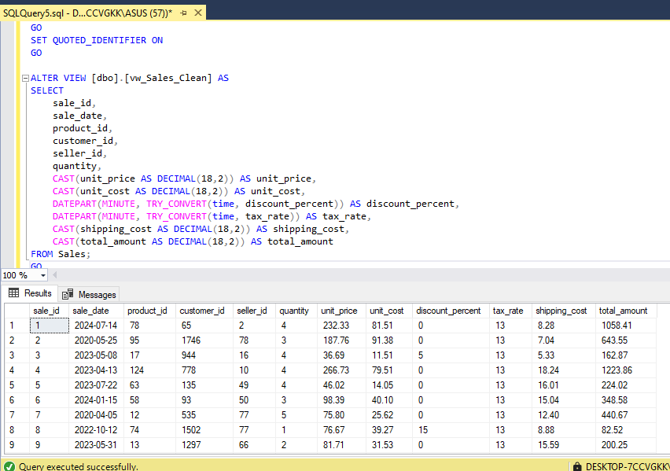
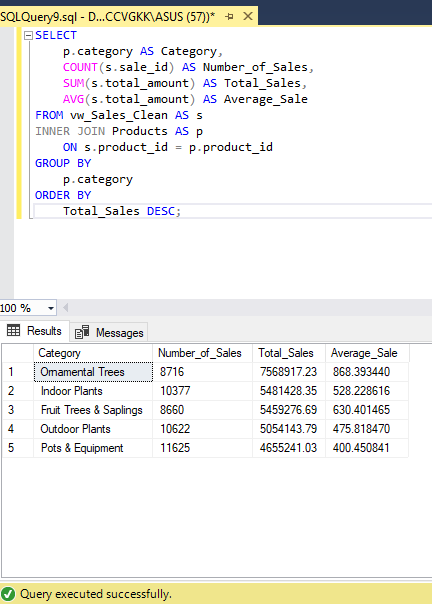
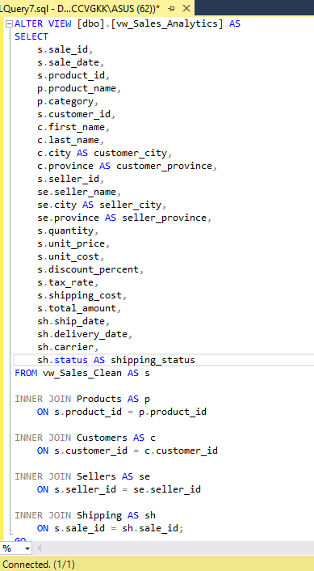
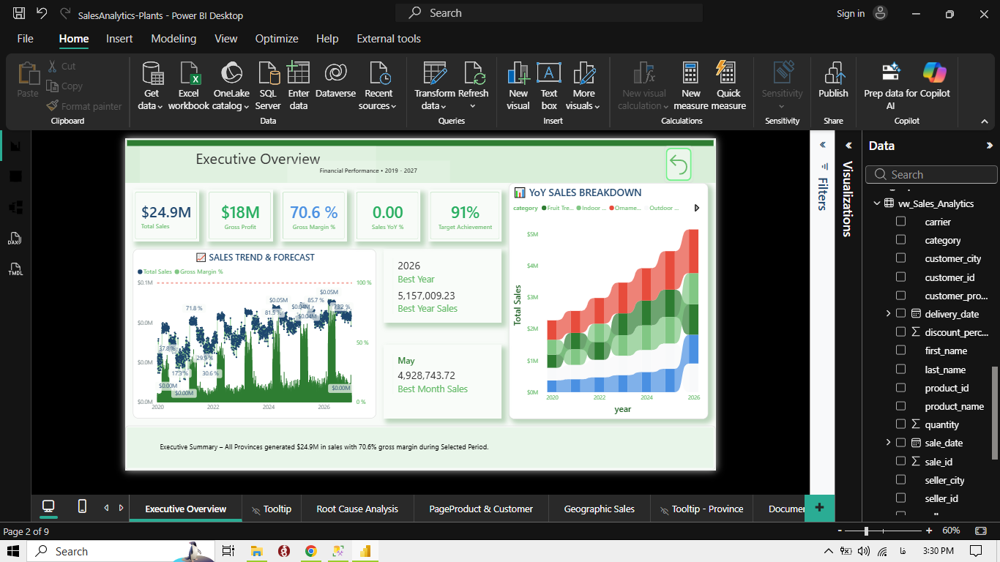

# Plants Sales — SQL Data Preparation & Power BI

SQL Server project for cleaning, validating, transforming, and preparing sales data for Power BI analysis.

## Project Overview

The project uses sales data from a Canadian plants and trees retail business.

The main focus is on using **SQL Server to prepare reliable, analysis-ready data** before connecting it to Power BI.

## SQL Operations

The following SQL operations were performed:

- Imported raw CSV data into SQL Server.
- Corrected inappropriate data types.
- Converted numeric fields to `DECIMAL`.
- Converted discount and tax values into numeric percentages.
- Checked for missing and invalid values.
- Validated relationships between related tables.
- Joined Sales with Products, Customers, Sellers, and Shipping.
- Created SQL Views for cleaned and analysis-ready data.
- Performed sales analysis using `SUM`, `AVG`, `COUNT`, `GROUP BY`, and `ORDER BY`.

## SQL Views

Two main views were created:

- `vw_Sales_Clean` — cleans and standardizes the Sales data.
- `vw_Sales_Analytics` — combines Sales with related dimension tables for analysis.

## Key Results

- Processed and validated 50,000 sales records.
- Verified product, customer, seller, and shipping relationships.
- Created reusable SQL Views for data preparation and analysis.
- Performed sales analysis by year, category, province, product, and seller.
- Connected the SQL-prepared dataset to Power BI for reporting and visualization.

## Power BI

The SQL-prepared dataset was connected to Power BI and used for DAX measures and dashboard analysis.

## Project Screenshots

### Database Structure

### Data Quality Check

### Clean Sales View

### Sales by Category

### Sales Analytics View

### Power BI Executive Overview

## SQL Files

- [Data Quality Checks](SQL/01_Data_Quality_Checks.sql)
- [Sales Clean View](SQL/02_Sales_Clean_View.sql)
- [Sales Analytics View](SQL/03_Sales_Analytics_View.sql)
- [Analysis Queries](SQL/04_Analysis_Queries.sql)

## Tools

- SQL Server
- SQL Server Management Studio (SSMS)
- Power BI
- DAX
